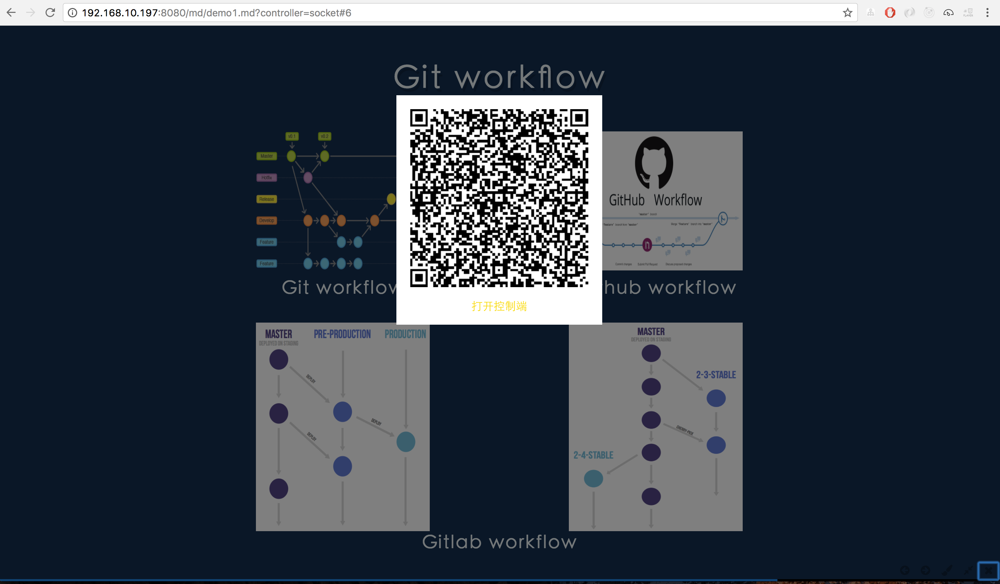
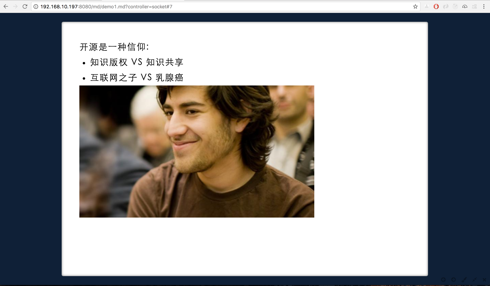

[slide]

# 效果图(nodeppt运行下图片不可见)

&nbsp;

[slide]
# 项目说明

- 这是用[markdown](http://markdown-here.com/)和[nodeppt](https://github.com/ksky521/nodeppt)完成的网页版演示文档PPT。
- 在浏览器内达到PPT的显示效果，包括翻页、动态显示、备注、图片放大等功能；
- 利用手机进行远程控制ppt效果，达到电子遥控笔的效果；
- 部分效果图如下：

    

        
        
效果图1

    

    

        
        
效果图2-备注

     

[slide]
# 在本地运行该项目

 1. 安装 nodeppt：`npm install nodeppt -g`
 2. 复制项目到本地：`git clone git@github.com:hbzyin/nodeppt.git webppt`
 3. 打开本地目录*webppt*: `nodeppt start`
 4. 在弹出的浏览器中选择 Git与工作流 项目，有两种打开方式
    1. 点击**多窗口**模式，进入正常浏览播放页面
    2. 点击**远程控制模式**，进入远程控制模式；
    3. 用移动电子设备扫描窗口中二维码，即可用电子设备远程控制播放。

[slide]

# 使用技巧说明

## 通用功能：

> 以下在**多窗口**和**远程控制**模式均可使用

 1. 点击键盘**下一页**切换到下一页ppt，或下一条动画；
 2. 利用键盘直接输入数字，然后按下Enter键，即可跳转到响应页面；
 4. 按下键盘**O**字母键，进入预览模式，可对ppt进行全部浏览；
 5. 按下键盘**P**字母键，进入画笔模式，可在页面内进行批注，点击**C**字母键，清楚批注，同时退出批注模式；
 6. 点击页面内图片，进入图片全屏预览模式，再次点击图片，退出全屏预览模式；
 7. 按**N**字母键弹出备注，再次按**N**,隐藏备注，该功能仅在有备注时可用，如【Git 工作流】第7页ppt中；
 8. 按**W**字母键进入宽屏模式，再次按**W**退出宽屏到正常模式；
 9. 鼠标移动到页面右下角会显示常用快捷功能按钮；

[slide]

# 使用技巧说明

## 远程控制模式功能

> 以下功能，仅适用于**远程控制**模式

1. 按下**Q**字母键，弹出远程控制二维码，移动设备扫描后便可进行远程控制；再次点击**Q**字母键，隐藏二维码

[slide]

# Thank you !

Author:hbzyin

Email: hbzyin@163.com

2017年07月29日